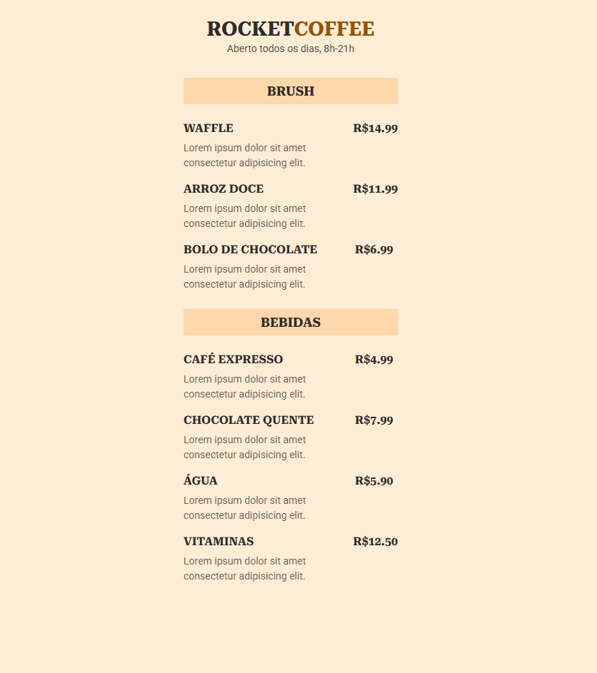

# RocketCoffee

Um site simples para exibição de um cardápio de cafeteria, utilizando **HTML** e **CSS**.

## 📷 Preview
  
*(Substitua `screenshot.png` pelo nome da sua imagem)*

## 🛠 Tecnologias
- **HTML5**
- **CSS3** (incluindo Google Fonts)

## 📂 Estrutura do Projeto
```
RocketCoffee/
├── index.html  # Estrutura principal do site
├── style.css   # Estilização do site
├── screenshot.png  # Imagem do site (adicione aqui)
```

## 🚀 Como Usar
1. Clone ou baixe este repositório
2. Abra o arquivo `index.html` no navegador

## 📌 Funcionalidades
- Exibe um menu de comidas e bebidas
- Layout simples e responsivo

---
📌 Feito com para estudo!

